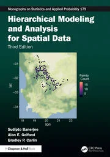
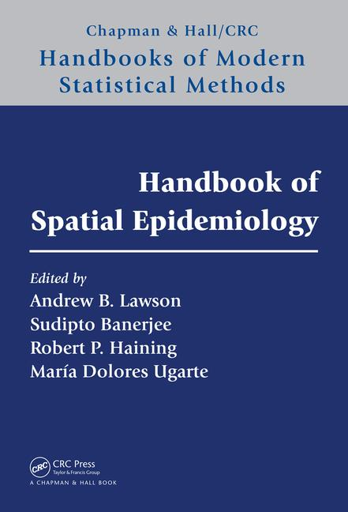
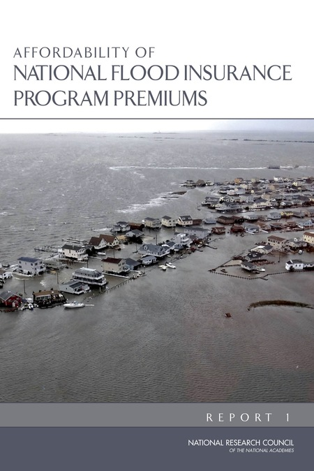

## Books and Monographs

### Hierarchical Modeling and Analysis for Spatial Data (Third Edition)

::: {.columns}

::: {.column width="30%"}

  

:::

::: {.column width="70%"}
The text presents a comprehensive and up-to-date treatment of hierarchical and multilevel modeling for spatial and spatio-temporal data within a Bayesian framework. Over the past decade since the second edition, spatial statistics has evolved significantly driven by an explosion in data availability and advances in Bayesian computation. The third edition reflects those changes, introducing new methods, expanded applications, and enhanced computational resources to support researchers and practitioners across disciplines, including environmental science, ecology, and public health.
<a href="https://www.routledge.com/Hierarchical-Modeling-and-Analysis-for-Spatial-Data/Banerjee-Gelfand-Carlin/p/book/9781032508559?srsltid=AfmBOoqMdo0t4W2O4kXYaz8AMM2OiZPS179j_zBvWcXYDzcmx2XKU5aO" target="_blank" class="btn-link">Visit Publisher</a>
:::

:::

### Linear Algebra and Matrix Analysis for Statistics

::: {.columns}

::: {.column width="30%"}

  

:::

::: {.column width="70%"}
*Linear Algebra and Matrix Analysis for Statistics* offers a gradual exposition to linear algebra without sacrificing the rigor of the subject. It presents both the vector space approach and the canonical forms in matrix theory. The book is as self-contained as possible, assuming no prior knowledge of linear algebra. Beginning with the rudimentary mechanics of linear systems, the book gradually develops a formal development of Euclidean vector spaces, rank and inverse of matrices, orthogonality, projections and projectors, eigenvalues, eigenvectors, different matrix decompositions (e.g., LU, Cholesky, QR, spectral, SVD, Jordan), positive definite matrices, Kronecker and Hadamard products, and concludes with accessible treatments of some more specialized topics, such as linear iterative systems, convergence of matrices, Markov chains and Page-Rank algorithms, and more general vector spaces.
<a href="http://www.crcpress.com/product/isbn/9781420095388" target="_blank" class="btn-link">Visit Publisher</a>
:::

:::

### Handbook of Spatial Epidemiology

::: {.columns}

::: {.column width="30%"}

  

:::

::: {.column width="70%"}
*Handbook of Spatial Epidemiology* explains how to model epidemiological problems and improve inference about disease etiology from a geographical perspective. Top epidemiologists, geographers, and statisticians share interdisciplinary viewpoints on analyzing spatial data and space–time variations in disease incidences. These analyses can provide important information that leads to better decision making in public health.
<a href="https://www.crcpress.com/Handbook-of-Spatial-Epidemiology/Lawson-Banerjee-Haining-Ugarte/p/book/9781482253016" target="_blank" class="btn-link">Visit Publisher</a>
:::

:::

## Reports

### National Academies: Affordability of National Flood Insurance Program Premiums

::: {.columns}

::: {.column width="30%"}

  

:::

::: {.column width="70%"}
*Affordability of National Flood Insurance Program Premiums: Report 1* is the first part of a two-part study to provide input as FEMA prepares their draft affordability framework. This report discusses the underlying definitions and methods for an affordability framework and the affordability concept and applications. Affordability of National Flood Insurance Program Premiums gives an overview of the demand for insurance and the history of the NFIP premium setting. The report then describes alternatives for determining when the premium increases resulting from Biggert-Waters 2012 would make flood insurance unaffordable.
<a href="https://www.nap.edu/catalog/21709/affordability-of-national-flood-insurance-program-premiums-report-1" target="_blank" class="btn-link">Visit Official Website</a>
:::

:::
