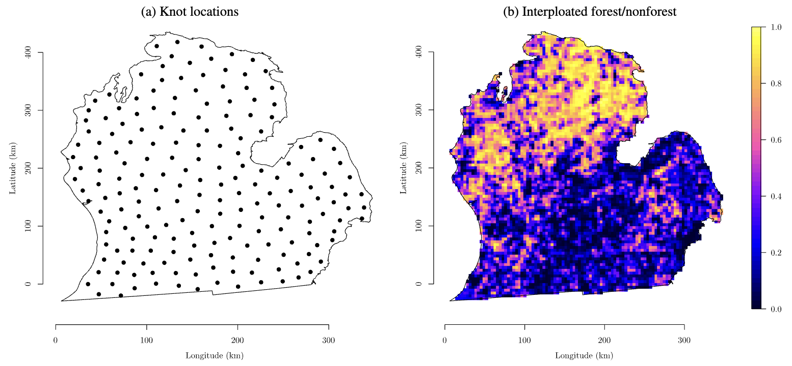

## Overview

The advent of Geographical Information Systems and related technologies have led to a burgeoning of spatial databases in a diverse set of disciplines. Statisticians and spatial analysts often encounter large to massive spatial and spatial-temporal data sets that are incomplete, involve layers of complex dependencies and demand accurate assessment of uncertainty. Professor Banerjee has undertaken several such projects throughout his career in substantive scientific fields such as ecology, forestry, climate and the environment, and public health.

## Featured publications

- Latimer, A.M., **Banerjee, S.**, Sang, H., Mosher Jr., E. and Silander, J.A. (2009). Hierarchical models for spatial analysis of large data sets: A case study on invasive plant species in the northeastern United States. *Ecology Letters*, **12**, 144–154. [DOI](http://dx.doi.org/10.1111/j.1461-0248.2008.01270.x).

- Finley, A.O., **Banerjee, S.** and MacFarlane, D.W. (2011). A hierarchical model for predicting forest variables over large heterogeneous domains. *Journal of the American Statistical Association*, **106**, 31–48. [DOI](http://dx.doi.org/10.1198/jasa.2011.ap09653).

- Delamater, P.L., Finley, A.O. and **Banerjee, S.** (2012). An analysis of asthma hospitalizations, air pollution, and weather conditions in Los Angeles County, California. *Science of the Total Environment*, **425**, 110–118. [DOI](http://dx.doi.org/10.1016/j.scitotenv.2012.02.015).

- Adgate, J.L., **Banerjee, S.**, Wang, M., McKenzie, L.M., Hwang, J., Cho, S.J. and Ramachandran, G. (2013). Performance of dust allergen carpet samplers in controlled laboratory studies. *Journal of Exposure Science and Environmental Epidemiology*, **23**, 385–391. [DOI](http://dx.doi.org/10.1038/jes.2012.112).

- Foster, J.R., Finley, A.O., D’Amato, A.W., Bradford, J.B. and **Banerjee, S.** (2016). Predicting tree biomass growth in the temperate-boreal ecotone: Is tree size, age, competition or climate response most important? *Global Change Biology*, **22**, 2138–2151. [DOI](http://dx.doi.org/10.1111/gcb.13208).
