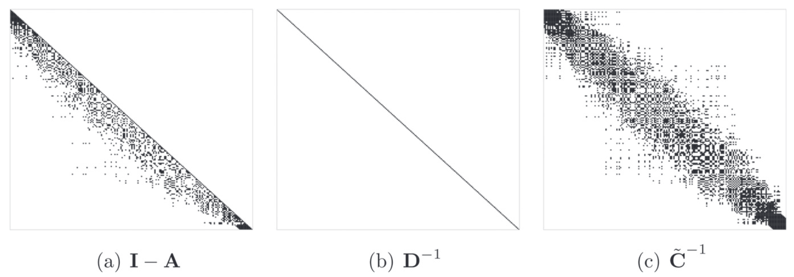

## Overview

Spatial data analysis for massive data sets with complex dependencies often require specialized computational algorithms in conjunction with scalable models. Professor Banerjee devotes considerable efforts in efficient algorithms and implementation of Bayesian hierarchical models for spatial and space-time data sets. Most of these enterprises are co-authored with his former doctoral students who have produced software to accompany the methodological developments in their dissertations.

## Featured publications

- Ren, Q., **Banerjee, S.**, Finley, A.O. and Hodges, J.S. (2011). Variational Bayesian methods for spatial data analysis. *Computational Statistics and Data Analysis*, **55**, 3197–3217. [DOI](http://dx.doi.org/10.1016/j.csda.2011.05.021).

<!--  - Eidsvik, J., Finley, A.O., **Banerjee, S.** and Rue, H. (2012). Approximate Bayesian inference for large spatial datasets using predictive process models. *Computational Statistics and Data Analysis*, **56**, 1362–1380. [DOI](http://dx.doi.org/10.1016/j.csda.2011.10.022).-->

- Finley, A.O., **Banerjee, S.** and Gelfand, A.E. (2015). spBayes: for large univariate and multivariate point-referenced spatio-temporal data models. *Journal of Statistical Software*, **64**, 1–28. [DOI](http://dx.doi.org/10.18637/jss.v063.i13).

- Finley, A.O., Datta, A., Cook, B.C., Morton, D.C. Andersen, H.E. and **Banerjee, S.** (2019). Efficient algorithms for Bayesian nearest-neighbor Gaussian processes. *Journal of Computational and Graphical Statistics*, **28**, 401–414. [DOI](https://doi.org/10.1080/10618600.2018.1537924).

- Zhang, L., Datta, A. and **Banerjee, S.** (2019). Practical Bayesian modeling and inference for massive spatial datasets on modest computing environments. *Statistical Analysis and Data Mining: The ASA Data Science Journal*, **12**, 197–209. [DOI](https://doi.org/10.1002/sam.11413).

- Coube-Sisqueille, S., **Banerjee, S.** and Liquet, B. (in press). Nonstationary spatial process models with spatially varying covariance kernels. *Journal of Computational and Graphical Statistics*. [DOI](https://doi.org/10.1080/10618600.2025.2516020)
