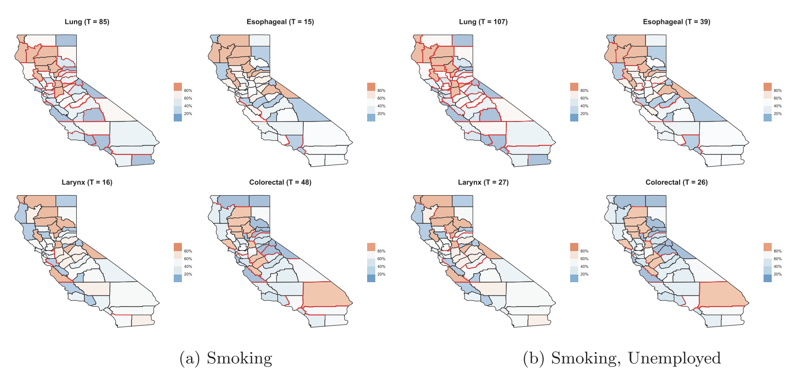

## Overview

Regional aggregates of health outcomes over delineated administrative units (e.g., states, counties, and zip codes), or areal units, are widely used by epidemiologists to map mortality or incidence rates and capture geographic variation. Spatial dependence in such models are usually captured using graphical probability distributions such as Markov random fields that model the spatial effects conditionally given
the effects of neighboring regions. Professor Banerjee has explored diverse aspects of such models and their inferential performance. He has developed novel classes of multivariate conditional auto-regression (MCAR) models and models building upon directed acyclic graphs (DAGAR models). He has also published original developments on spatial boundary analysis or areal wombling to identify neighboring regions with significant health oriented spatial disparities.

## Featured publications

- Jin, X., Carlin B.P., and **Banerjee, S.** (2005). Generalized hierarchical multivariate CAR models for areal data. *Biometrics*, **61**, 950–961. [DOI](http://dx.doi.org/10.1111/j.1541-0420.2005.00359.x).

- Martinez-Beneito, M.A., Botella-Rocomara, P. and **Banerjee, S.** (2017). Towards a multi-dimensional approach to Bayesian disease mapping. *Bayesian Analysis*, **12**, 239–259. [DOI](http://dx.doi.org/10.1214/16-BA995).

- Li, P., **Banerjee, S.**, Hanson, T.A. and McBean, A.M. (2015). Bayesian models for detecting difference boundaries in areal data. *Statistica Sinica*, **25**, 385–402. [DOI](http://dx.doi.org/10.5705/ss.2013.238w).

- Datta, A., **Banerjee, S.**, Hodges, J.S. and Gao, L. (2019). Spatial disease mapping using directed acyclic graph auto-regressive (DAGAR) models. *Bayesian Analysis*, **14**, 1221–1244. [DOI](https://doi.org/10.1214/19-BA1177).

- Gao, L., **Banerjee, S.** and Ritz, B. (2023). Spatial difference boundary detection for multiple
outcomes using Bayesian disease mapping. *Biostatistics*, **24**, 922–944. [DOI](https://doi.org/10.1093/biostatistics/kxac013).
