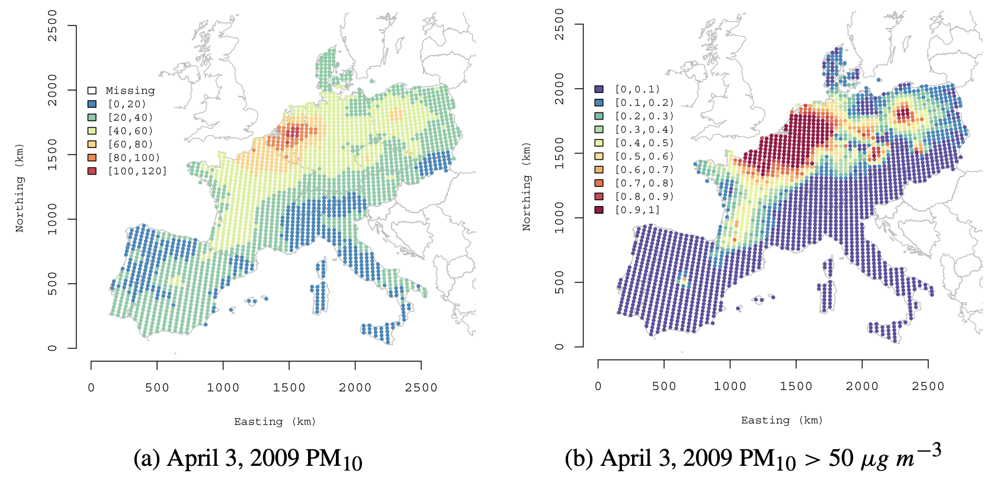

## Overview

Machine learning and high performance computing have unfurled conundrums surrounding the role of mechanistic modeling in scientific inference. Mechanistic systems refer to models built from scientific principles and laws that help understand complex mechanisms posited to be generating observational data. While machine learning algorithms often seek to circumvent the complex mechanisms through the use of large-scale data sets, mechanistic models attempt to directly relate the data to the laws of basic science. These two modeling paradigms often tend to operate exclusive to each other. Dr. Banerjee has developed approaches for integrating these two apparently antagonistic paradigms into a single comprehensive inferential framework. Building upon developments in Bayesian inferential frameworks for spatial-temporal mechanistic models, Dr. Banerjee has proposed stochastic dynamical systems engendering full probabilistic uncertainty quantification for environmental processes.

## Featured publications

<!-- - Zhang, Y., **Banerjee, S.**, Yang, R., Lungu, C. and Ramachandran, G. (2009). Bayesian modelling of air flow and exposure using two-zone models. *Annals of Occupational Hygiene*, **53**, 409–424. [DOI](http://dx.doi.org/10.1093/annhyg/mep017).-->

- Finley, A.O., **Banerjee, S.** and Basso, B. (2011). Improving crop model inference through Bayesian melding with spatially-varying parameters. *Journal of Agricultural, Biological and Environmental Statistics*, **16**, 453–474. [DOI](http://dx.doi.org/10.1007/s13253-011-0070-x).

- Monteiro, J.V., **Banerjee, S.** and Ramachandran, G. (2014). Bayesian modeling for physical processes in industrial hygiene using misaligned workplace data. *Technometrics*, **56**, 238–247. [DOI](http://dx.doi.org/10.1080/00401706.2013.836988).

- Datta, A., **Banerjee, S.**, Finley, A.O., Hamm, N.A.S. and Schaap, M. (2016). Non-separable dynamic nearest neighbor Gaussian process models for large spatio-temporal data with application to particulate matter analysis. *Annals of Applied Statistics*, **10**, 1286–1316. [DOI](http://dx.doi.org/10.1214/16-AOAS931). (Winner of the 2017 American Statistical Association’s Outstanding Application
Award).

- Abdalla, N., **Banerjee, S.**, Ramachandran, G. and Arnold, S. (2020). Bayesian state space modeling of physical processes in industrial hygiene. *Technometrics*, **62**, 147–160. [DOI](https://doi.org/10.1080/00401706.2019.1630009).

- **Banerjee, S.**, Chen, X., Frankenburg, I. and Zhou, D. (2025). Dynamic Bayesian learning for spatiotemporal mechanistic models. *Journal of Machine Learning Research*, **26(146)**, 1–43. [URL](http://jmlr.org/papers/v26/22-0896.html).
  
