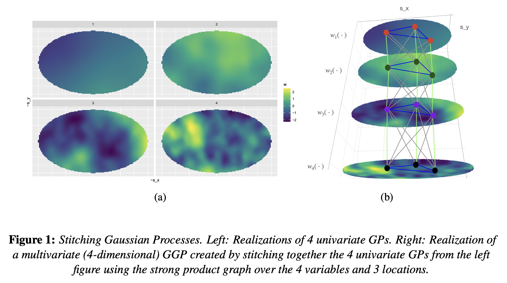

## Overview

Multivariate spatial processes refer to collections of spatial or spatial-temporal processes, where each process captures spatial dependence while also being associated with the other processes in the collection. Building valid multivariate processes and multivariate spatial probability laws is a crucial exercise in the analysis of environmental and public health data where different spatially-oriented variables of interest are associated among themselves in addition to being spatially dependent. Multivariate processes also arise in constructing spatially varying regression models, where the slopes in the regression model are spatial processes designed to capture associations in the way they impact the outcome or response over space and time. Statistical models for capturing multivariate spatial dependencies must also overcome complications arising from *spatial misalignment* and *change of support* problems, which refer to settings when not all of the variables of interest have been measured over the same set of spatial locations. Professor Banerjee has published an array of articles on developing rich and flexible yet computationally practicable methods for analyzing complex multivariate dependencies in spatial data arising in environmental sciences and public health research.

## Featured publications

- **Banerjee, S.** and Johnson, G.A. (2006). Coregionalized single and multi-resolution spatially varying growth curve modeling with application to weed growth. *Biometrics*, **62**, 864–876. [DOI](http://dx.doi.org/10.1111/j.1541-0420.2006.00535.x).

- Jin, X., **Banerjee, S.** and Carlin, B.P. (2007). Order-free coregionalized areal models with application to multiple disease mapping. *Journal of the Royal Statistical Society: Series B (Methodology)*, **69**, 817–838. [DOI](http://dx.doi.org/10.1111/j.1467-9868.2007.00612.x).

- **Banerjee, S.**, Finley, A.O., Waldmann, P. and Ericsson, T. (2010). Hierarchical spatial process models for multiple traits in large genetic trials. *Journal of the American Statistical Association*, **105**, 506–521. [DOI](http://dx.doi.org/10.1198/jasa.2009.ap09068).

- Zhang, L. and **Banerjee, S.** (2022). Spatial factor modeling: A Bayesian Matrix-Normal approach for misaligned data. *Biometrics*, **78**, 560–573. [DOI](https://doi.org/10.1111/biom.13452).

- Dey, D., Datta, A. and **Banerjee, S.** (2022). Graphical Gaussian process models for highly multivariate spatial data. *Biometrika*, **109**, 993–1014. [DOI](https://doi.org/10.1093/biomet/asab061).
