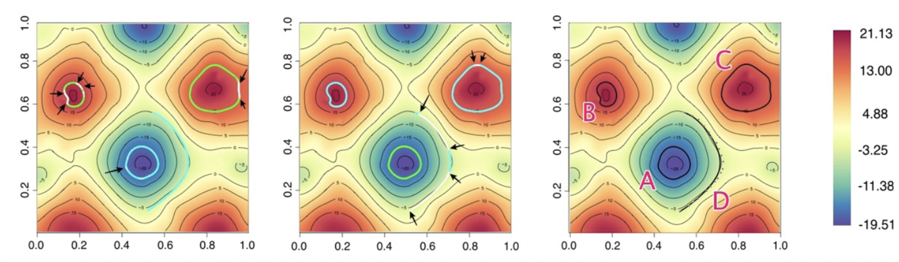

## Overview

Stochastic process models are widely employed for analyzing spatiotemporal datasets in various scientific disciplines including, but not limited to, environmental monitoring, ecological systems, forestry, hydrology, meteorology, and public health. After inferring on a spatiotemporal process for a given dataset, inferential interest may turn to estimating rates of change, or gradients, over space and time. Dr. Banerjee has developed fully model-based inference on spatiotemporal gradients under continuous space, continuous time settings.  Dr. Banerjee's contribution has been to offer, within a flexible spatiotemporal process model setting, a framework to estimate arbitrary directional gradients over space at any given time-point, temporal derivatives at any given spatial location and, finally, mixed spatiotemporal gradients that reflect rapid change in spatial gradients over time and vice-versa.

## Featured publications

- **Banerjee, S.**, Gelfand, A.E. and Sirmans, C.F (2003). Directional Rates of Change Under Spatial Process Models. *Journal of the American Statistical Association*, **98**, 946-954. [DOI](https://doi.org/10.1198/C16214503000000909).

- **Banerjee, S.** and Gelfand, A.E. (2006). Bayesian Wombling: Curvilinear gradient assessment under spatial process models. *Journal of the American Statistical Association*, **101**, 1487-1501. [DOI](https://doi.org/10.1198/016214506000000041).

- **Banerjee, S.** (2010). Spatial gradients and wombling. In *Handbook of Spatial Statistics*, eds. A.E. Gelfand, P. Diggle, P. Guttorp, and M. Fuentes. Boca Raton, FL: Taylor and Francis/CRC, pp. 559–574. [DOI](http://dx.doi.org/10.1201/9781420072884-c31).

- Quick, H., **Banerjee, S** and Carlin, B.P. (2015). Bayesian modeling and analysis for gradients in spatiotemporal processes. *Biometrics*, **71**, 575–584. [DOI](https://doi.org/10.1111/biom.12305).

- Halder, A., **Banerjee, S.** and Dey, D.K. (2024). Bayesian modeling with spatial curvature processes. *Journal of the American Statistical Association*, **119**, 1155–1167. [DOI](https://doi.org/10.1080/01621459.2023.2177166).
