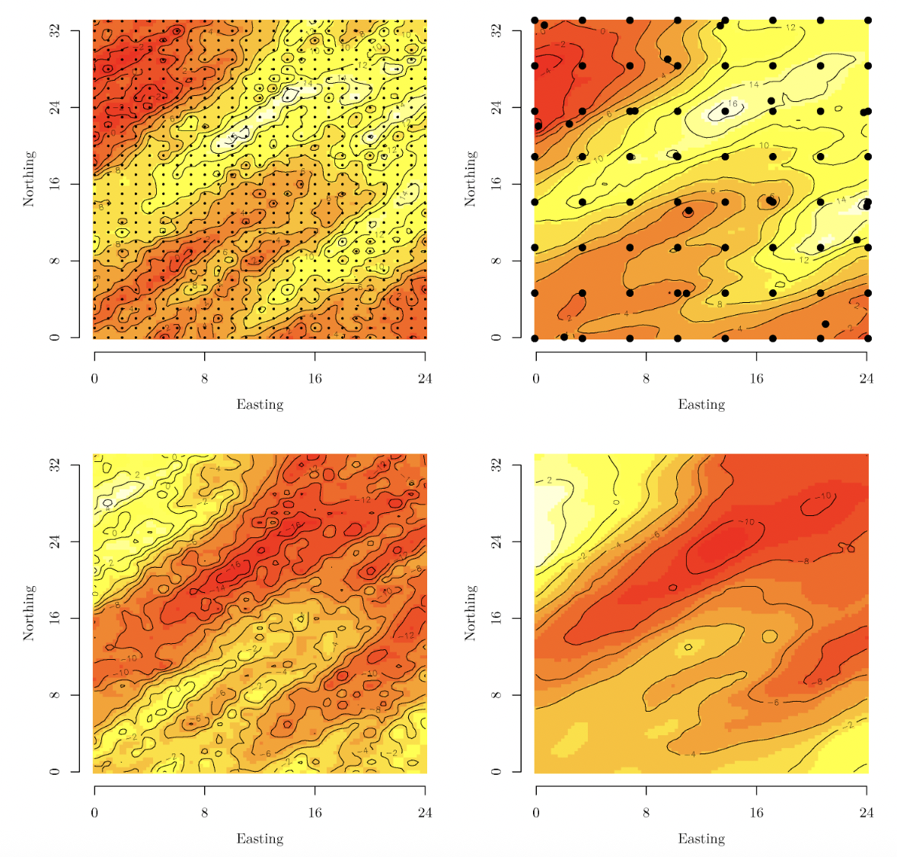

## Overview

Spatial process models for analyzing geostatistical data entail computations that become prohibitive as the number of spatial locations become large. Dr. Banerjee has led pioneering contributions in model-based solutions for spatial “BIG DATA” analysis. These include the development and implementation of classes of low-rank spatial process models known as “predictive processes” that achieve dimension-reduction by projecting the original process on an optimal lower-dimensional subspace. Another, more recent, line of research led by Dr. Banerjee develop sparsity-inducing spatial processes known as "Nearest-Neighbor Gaussian processes" (NNGP) that achieve scalabilty by exploiting sparsity in models without discarding spatial information. Finally, Dr. Banerjee has also explored "meta-kriging", which refers to dividing and conquering massive spatial data sets by analyzing subsets of the data and subsequently pooling the analyses to draw inference for the entire data. These approaches have attracted significant attention among statisticians and practitioners and are widely deployed to deliver inference for massive spatial databases without compensating for richness of modeling.

## Featured publications

- **Banerjee, S.**, Gelfand, A.E., Finley, A.O. and Sang, H. (2008). Gaussian predictive process models for large spatial datasets. *Journal of the Royal Statistical Society: Series B (Methodology)*, **70**, 825-848. [DOI](https://doi.org/10.1111/j.1467-9868.2008.00663.x).

- Datta, A., **Banerjee, S.**, Finley, A.O. and Gelfand, A.E. (2016). Hierarchical nearest-neighbor Gaussian process models for large spatial data. *Journal of the American Statistical Association*, **111**, 800-812. [DOI](https://doi.org/10.1080/01621459.2015.1044091).

- **Banerjee, S.** (2017). High-dimensional Bayesian geostatistics. *Bayesian Analysis*, **12**, 583–614. [DOI](http://dx.doi.org/10.1214/17-BA1056R).

- Guhaniyogi, R. and **Banerjee, S.** (2018). Meta-Kriging: Scalable Bayesian modeling and inference for massive spatial datasets. *Technometrics*, **60**, 430–444. [DOI](https://doi.org/10.1080/00401706.2018.1437474).

- Peruzzi, M., **Banerjee, S.** and Finley, A.O. (2022). Highly scalable Bayesian geostatistical modeling via meshed Gaussian processes on partitioned domains. *Journal of the American Statistical Association*, 117, 969–982. [DOI](https://doi.org/10.1080/01621459.2020.1833889).
