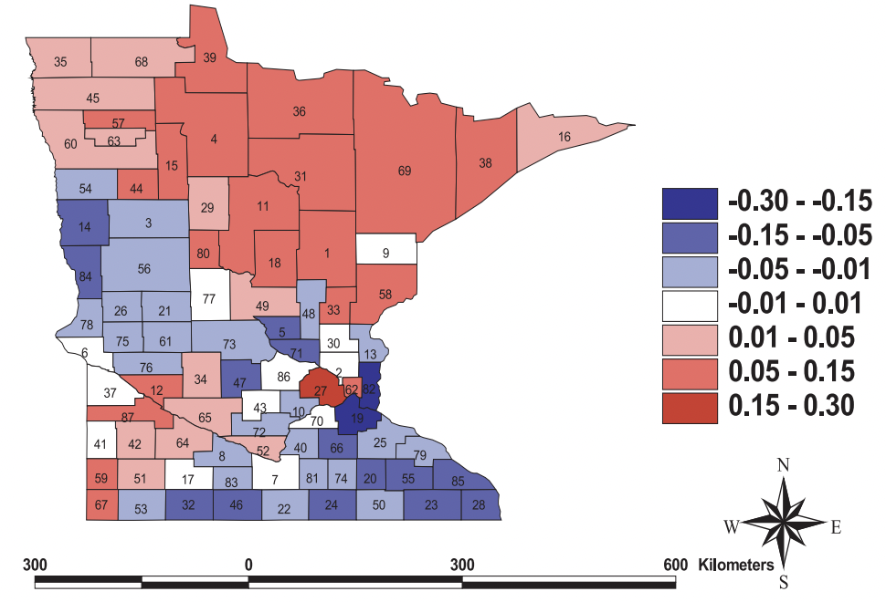

## Overview

Spatial variation in survival patterns often reveal underlying lurking factors, which, in turn, assist researchers
and data science professionals in their decision making process to identify regions requiring attention. Dr.
Banerjee pioneered the development of hierarchical models for spatially dependent time-to-event data.

## Featured publications

- **Banerjee, S.**, Wall, M. and Carlin, B.P. (2003). Frailty modeling for spatially correlated survival data with application to infant mortality in Minnesota. *Biostatistics*, **4**, 4123-142. [DOI](https://doi.org/10.1093/biostatistics/4.1.123).

- **Banerjee, S.** and Carlin, B.P. (2004). Parametric spatial cure rate models for interval-censored time-to-relapse data. *Biometrics*, **60**, 268-275. [DOI](https://doi.org/10.1111/j.0006-341X.2004.00032.x).

- Cooner, F., **Banerjee, S.**, Carlin, B.P. and Sinha, D. (2007). Flexible cure rate modeling under latent activation schemes. *Journal of the American Statistical Association*, **102**, 560–572. [DOI](http://dx.doi.org/10.1198/016214507000000112).

- **Banerjee, S.**, Kauffman, R.J. and Wang, B. (2007). Modeling Internet firm survival using Bayesian dynamic models with time-varying coefficients. *Electronic Commerce Research and its Applications*, **6**, 332–342. [DOI](http://dx.doi.org/10.1016/j.elerap.2006.06.004).

- Diva, U., Dey, D.K. and **Banerjee, S.** (2008). Parametric models for spatially correlated survival data for individuals with multiple cancers. *Statistics in Medicine*, **27**, 2127-2144. [DOI](https://doi.org/10.1002/sim.3141).