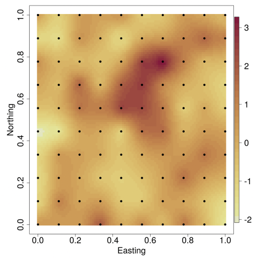
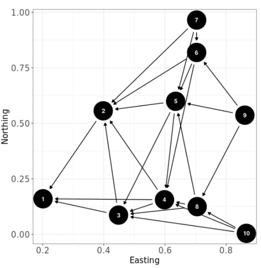
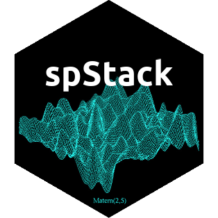
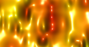
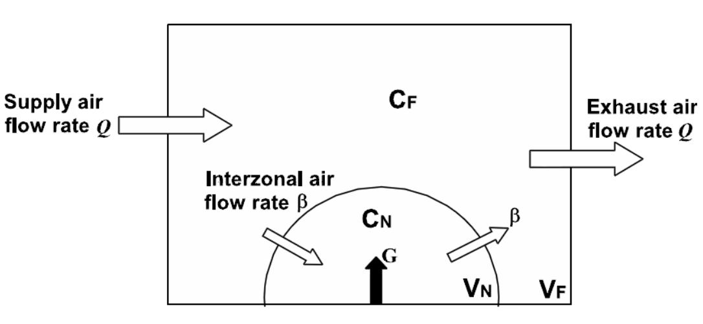

*See Dr. Banerjee's [GitHub](https://github.com/sudiptobanerjee) page for software repositories and source codes from several other projects under development.*

## R Packages

### spBayes: Univariate and Multivariate Spatio-temporal Modeling

::: {.columns style="display: flex; flex-wrap: nowrap; align-items: center;"}
::: {.column width="70%"}
spBayes fits univariate and multivariate models with Markov chain Monte Carlo (MCMC). Core functions include:

- `spLM`: univariate Gaussian regression with spatial random effects
- `spMvLM`: multivariate Gaussian regression with spatial random effects
- `spMisalignLM`: multivariate Gaussian regression with spatial random effects for misaligned data
- `spGLM`: univariate Logistic and Poisson regression with spatial random effects
- `spMvGLM`: multivariate Logistic and Poisson regression with spatial random effects
- `spMisalignGLM`: multivariate Logistic and Poisson regression with spatial random effects for misaligned data
- `spDynLM`: univariate Gaussian regression with dynamic space-time random effects
:::

::: {.column style="width: 30%; display: flex; justify-content: center;"}

:::
:::

For the core functions, a predictive process model can be specified for large data sets. Also adaptive MCMC is available for those parameters that cannot be updated using Gibbs. The stable version is available on [CRAN](https://cran.r-project.org/package=spBayes).

### spNNGP: Spatial Regression Models for Large Datasets using Nearest Neighbor Gaussian Processes

::: {.columns style="display: flex; flex-wrap: nowrap; align-items: center;"}
::: {.column width="70%"}
spNNGP fits Gaussian univariate Bayesian spatial regression models for massive datasets using "Nearest Neighbor Gaussian Processes (NNGP)". Core functions include:

- `CHM`: Canopy Height Model from NASA Goddard's LiDAR Hyperspectral and Thermal (G-LiHT)
- `spConjNNGP`: Function for fitting univariate Bayesian conjugate spatial regression models
- `spNNGP`: Function for fitting univariate Bayesian spatial regression models
- `spPredict`: Function for prediction at new locations using spNNGP models
:::

::: {.column style="width: 30%; display: flex; justify-content: center;"}

:::
:::

The stable version is available on [CRAN](https://CRAN.R-project.org/package=spNNGP).

### spStack: Bayesian Geostatistics Using Predictive Stacking

::: {.columns style="display: flex; flex-wrap: nowrap; align-items: center;"}
::: {.column width="70%"}
Fast Bayesian inference for Gaussian and non-Gaussian geospatial models without using Markov chain Monte Carlo algorithms. This R package is written in C++ with calls to FORTRAN routines for optimized linear algebra operations. Core functions include:

- `spLMstack`: spatial linear model using Bayesian predictive stacking
- `spGLMstack`: spatial GLM using Bayesian predictive stacking
- `stvcGLMstack`: spatial-temporal GLM using Bayesian predictive stacking
- `recoverGLMscale`: Recover posterior samples of scale parameters in spatial-temporal GLMs
- `posteriorPredict`: Prediction of latent process at new spatial or temporal locations
:::

::: {.column style="width: 30%; display: flex; justify-content: center;"}

:::
:::

The stable version is available on [CRAN](https://cran.r-project.org/package=spStack).

### MBA: Multilevel B-spline Approximation

::: {.columns style="display: flex; flex-wrap: nowrap; align-items: center;"}
::: {.column width="70%"}
MBA generates surfaces interpolated from scattered data using Multilevel B-Splines. The most recent version is available on [CRAN](https://CRAN.R-project.org/package=MBA).
:::

::: {.column style="width: 30%; display: flex; justify-content: center;"}

:::
:::

### B2Z: Bayesian Two-Zone Model

::: {.columns style="display: flex; flex-wrap: nowrap; align-items: center;"}
::: {.column width="70%"}
This package fits the Bayesian two-zone models. The most recent version is available on [CRAN](https://cran.r-project.org/package=B2Z).
:::

::: {.column style="width: 30%; display: flex; justify-content: center;"}

:::
:::

## C++ Programs

### Statpack.zip

[**Statpack.zip** ](/files/software/StatPack.zip) is a zip file containing the following files:

- **lapack.cpp**: a C++ file containing several matrix algebra functions, including basic matrix and vector operations (addition, subtraction, multiplication, kronecker products), matrix inversion, solving linear systems, determinants, log-determinants, matrix decompositions (Cholesky, LU, QR and SVD), eigen-values and eigen-vectors etc. Only C++ classes have been used (not templates) to make this more accessible (for example C programmers can easily port these functions). The header file containing the class definitions is **lapack.h**.
- **generators.cpp**: a C++ file containing some useful random number generation routines from different distributions: uniform, normal, exponential, gamma, beta, multinomial, multivariate normal, Wishart and inverted-Wishart. The header file is **generators.h**.
- A makefile format for creating a static library, **StatPack.a** is also included.

### Spatial.zip

[**Spatial.zip** ](/files/software/Spatial.zip) is a zip file containing the following files:

- **areal.cpp**: C++ functions for statistical modelling of areal data . Includes the CAR prior and some functions for creating the neighborhoods.
- **geodesy.cpp**: C++ functions for calculating geodetic distances based upon latitude-longitude and also for euclidean distances. These are useful for geostatistical modelling.

## Java Programs

### Statpack.jar

- [**Statpack.jar** ](/files/software/StatPack.jar) is a Java Archive file containing the JAMA (JAvaMAtrix) package from NIST (I have added a kronecker method for kronecker products and a symmetrize method that helps in stabilizing symmetric matrices for Cholesky decompositions). Also included is a Distribution package with classes for random number generation, and some useful functions for spatial modelling. Just add StatPack.jar to your CLASSPATH and you should be able to access the methods.

### JaLAJni

- [**JaLAJni**](https://github.com/JaLAJni/JaLAJni): These are JAVA packages providing Java interfaces for numerical linear algebra using the LAPACK and BLAS libraries. This contains two different versions: JaLAJni and JaLAJniLite. Both of them serve as a Java interface for LAPACK and BLAS. The main difference is that JaLAJni calls an intermediate C interface - cblas and lapacke - which requires previous installation. So if you want to use JaLAJni, you have to install cblas and lapacke first (detailed installation instructions are available from the website). JaLAJniLite is a simplified version which requires no installation of any libraries other than LAPACK and BLAS that can be installed in Linux/Windows/MacOS either as precompiled binaries or built from source using Fortran compilers (such as gfortran).

### JAMAJni

- [**JAMAJni**](https://github.com/JAMAJni): These are JAVA packages providing Java interfaces for numerical linear algebra using the matrix classes provided by [JAMA](https://math.nist.gov/javanumerics/jama/). However, unlike JAMA, JAMAJni uses LAPACK and BLAS libraries for matrix computations. The JAMAJni github page contains two different versions: JAMAJni and JAMAJniLite. Both of them serve as a Java interface for LAPACK and BLAS. The main difference is that JAMAJni calls an intermediate C interface - cblas and lapacke - which requires previous installation. So if you want to use JAMAJni, you have to install cblas and lapacke first (detailed installation instructions are available from the website). JAMAJniLite is a simplified version which requires no installation of any libraries other than LAPACK and BLAS that can be installed in Linux/Windows/MacOS either as precompiled binaries or built from source using Fortran compilers (such as gfortran).

### LinearModel.zip

- [**LinearModel.zip** ](/files/software/LinearModel.zip) contains some simple linear model examples that are fitted using MCMC. They include Gibbs samplers, component-wise Metropolis (in subdirectory Metropolis) and joint Metropolis (in two different Java styles, uner Metropolis2 and Metropolis3). These do not really need MCMC, but can prove useful for someone starting to hard-code MCMC. Uses the statpack.jarfile.

## Other R programs

- Installing geo-R: The file [InstallingGeoR](/files/software/InstallingGeoR.txt) is a simple text file containing instructions to install geoR on R for Windows and Linux.
- Getting started with geo-R: The file [Book.R](/files/software/Book.R) is a simple introduction to some geoR functions that illustrate some spatial analysis tools using the scallops data, found in [scallops.txt](/files/software/scallops.txt).
- A Bayesian kriging example: The file [Bayes1.R](/files/software/Bayes1.R) is a first example of Bayesian kriging in geoR on the data [TemperaturePrecipitationElevation.txt](/files/software/TempPptElevData.txt).
- [distonearth.R](/files/software/distonearth.R) is a R source file containing functions for computing distances on the earth's surface using different methods. Some of these have been used in my Biometrics paper [On Geodetic Distance Computations in Spatial Modelling](https://doi.org/10.1111/j.1541-0420.2005.00320.x) as given in the file [GeodesicsExample.R](/files/software/GeodesicsExample.R).
- [Slopes.zip](/files/software/Slopes.zip) is a zip file containing the R program to compute spatial gradients using the methods described in Banerjee, S., Gelfand, A.E. and Sirmans, C.F (2003). "Directional Rates of Change Under Spatial Process Models". *Journal of the American Statistical Association*, **98**:946-954.
- [OrderFreeGMCARwin32.zip](/files/software/OrderFreeGMCARwin32.zip) and [OrderFreeGMCARlinux.zip](/files/software/OrderFreeGMCARlinux.zip) are zip files containing the programs and the Minnesota cancer data used in the manuscript Jin, X., Banerjee, S. and Carlin, B.P. (2006) [Order-free Coregionalized Areal Data Models with Application to Multiple Disease Mapping](https://doi.org/10.1111/j.1467-9868.2007.00612.x). The programs are written in C to harness maximum efficiency in terms of speed and use the Rlapack and Rblas libraries for matrix computations. They can be run from within R by sourcing the `mcar.R` function present in the directory. The Linux version includes a `Makefile` that compiles and creates the `mcar_main.so` dynamic library which is dynamically loaded by `mcar.R`.

## WinBUGS Programs

- [CBCScodes.txt](/files/software/CBCScodes.txt) is a text file containing the WinBUGS programs to compute cure rate models using the methods described in Cooner, F., Banerjee, S., Carlin, B.P. and Sinha, D. (2007). "Flexible Cure Rate Modelling Under Latent Activation Schemes". *Journal of the American Statistical Association*.
